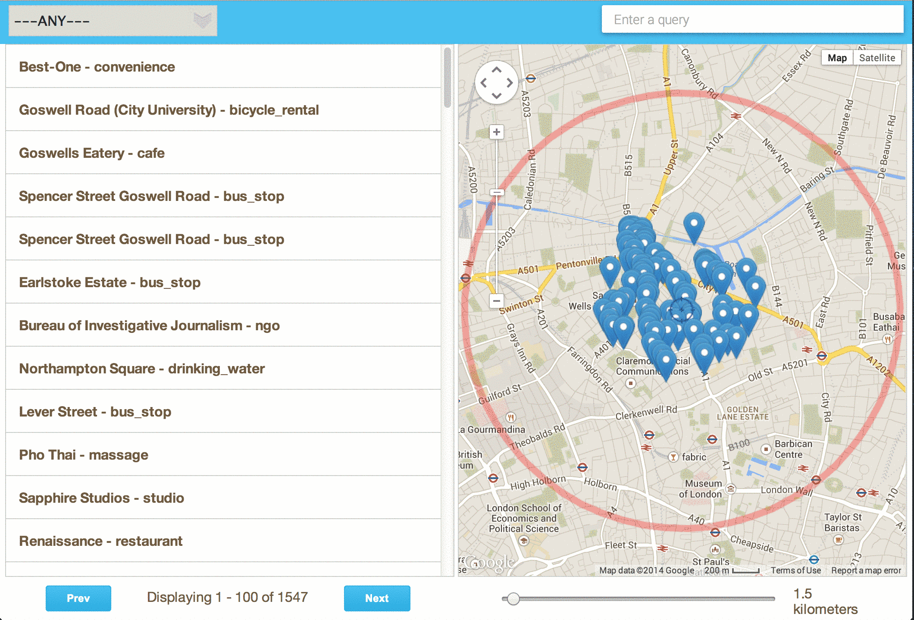

AroundMe
========

This is a Demo of using Spatial Search feature in [ElasticSearch](http://www.elasticsearch.org/)
  
 
>


Setup
-----

This project is build using grunt, to get started read [here](http://gruntjs.com/installing-grunt)

Once ```grunt``` is installed ```cd``` to AroundMe and run ```grunt```, however for convinince ```index.js``` in build folder is also checked in.

You will  need to install [ElasticSearch](http://www.elasticsearch.org/), read about installing it [here](http://www.elasticsearch.org/guide/en/elasticsearch/guide/current/_installing_elasticsearch.html), also install [marvel](http://www.elasticsearch.org/guide/en/marvel/current/) plugin for configuration and testing.

The data used here is from [Geofabrik](http://download.geofabrik.de/).

I have used points.shp file from the  [Great-Britain](http://download.geofabrik.de/europe/great-britain.html) shape file download, but you can use any other country as well.

To extract the data,I wrote a quick python script using  [pyshp](https://code.google.com/p/pyshp/)

you can easily install it by typing ```sudo easy_install pyshp```.

Before running the script you will have to create an Index and add schema to it.

Assuming that elastic search is running, you can issue a command from marvel.
```
PUT /places
{
    "mappings": {
        "place": {
            "properties": {
                "id": {"type": "double"},
                "name": {"type": "string"},
                "type": {"type": "string"},
                "location": {"type": "geo_point"}
            }
        }
    }
}
```

Modify the path in script below to the source file, "points" in this case and run the script.
```
import shapefile
import urllib2
import json
sf = shapefile.Reader("points")
sr = sf.shapeRecords()

for r in sr:
    try :
        if r.record[2].strip() and r.record[3].strip():
            req = urllib2.Request('http://localhost:9200/places/place/')
            req.add_header('Content-Type', 'application/json')
            data = {'id': r.record[0].strip(),'name':r.record[2].strip(),'type':r.record[3].strip(),'location':{'lat':r.shape.points[0][1],'lon':r.shape.points[0][0]}}
            response = urllib2.urlopen(req, json.dumps(data))
            print r.record[2]
    except Exception,e: 
        print e
        #print "ERROR ",r.record[0],r.record[2],r.record[3] , r.shape.points[0][0], r.shape.points[0][1]
        pass

```
The script inserts all records which have a valid ```name``` and type ```column``` into index.

  

To get the count of records in index
------------------------------------
```GET places/_count```


To search by geodistance (a.k.a find near)
------------------------------------------
```
GET places/_search
{
  "sort" : [
      {
          "_geo_distance" : {
              "location" : {
                    "lat": 51.5286416,
                "lon": -0.10159870000006777
              }, 
              "order" : "asc",
              "unit" : "km"
          }
      }
  ],
  "query": {
    "filtered" : {
        "query" : {
            "match_all" : {}
        },
        "filter" : {
            "geo_distance" : {
                "distance" : "20km",
                "location" : {
                   "lat": 51.5286416,
                "lon": -0.10159870000006777
                }
            }
        }
    }
  }
}```

To search by geodistance and filter term
------------------------------------------
```
GET places / _search ? size = 100 & from = 0 {
    "sort": [{
        "_geo_distance": {
            "location": {
                "lat": 51.5286416,
                "lon": -0.10159870000006777
            },
            "order": "asc",
            "unit": "km"
        }
    }],
    "query": {
        "filtered": {
            "query": {
                "bool": {
                    "should": [{
                        "term": {
                            "type": "pub"
                        }
                    }]
                }
            },
            "filter": {
                "geo_distance": {
                    "distance": "1km",
                    "location": {
                        "lat": 51.5286416,
                        "lon": -0.10159870000006777
                    }
                }
            }
        }

    }
}
```

Final step is to configure a proxy to server html and to route ajax requests to ```localhost9200.```

In this case the server in use is nginx, below is the minimal configuration, The ```localhost:80``` is mapped to server contents of AroundMe folder
and the proxy is mapped to route requests ```/elastic ```to ```localhost:9200```


```
server {
        listen       80;
        server_name  localhost;

        #charset koi8-r;

        #access_log  logs/host.access.log  main;

        location / {
            root   /Users/varunpant/Documents/Github/AroundMe;
            index  index.html index.htm;
        }
        location /elastic/ {
            proxy_pass http://localhost:9200/;
        }

        #error_page  404              /404.html;

        # redirect server error pages to the static page /50x.html
        #
        error_page   500 502 503 504  /50x.html;
        location = /50x.html {
            root   html;
        } 
    }
```


Once configured restart the server and browse to ```localhost```  :)
 
I hope you find it useful.

If you like or use this project somewhere please contact me at
```varun@varunpant.com```


